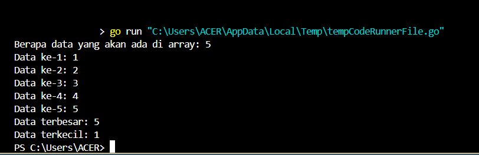
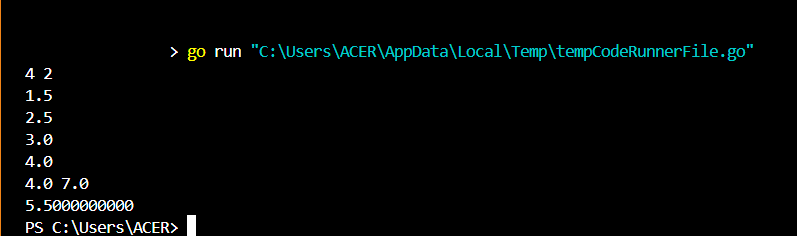
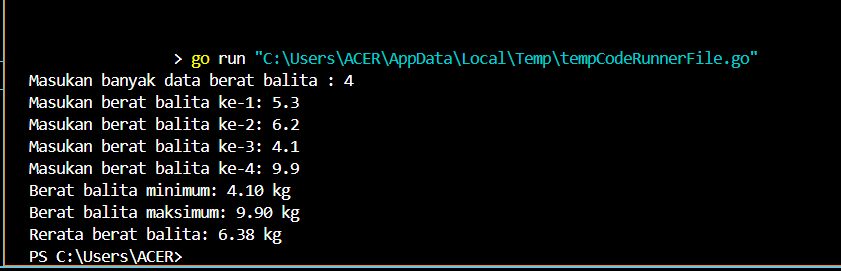

<h1 align="center">Laporan Praktikum Modul 10 <br>Pencarian Nilai Ekstrim Pada Himpunan Data</h1>

<p align="center">TRISNA KUSUMA RAMADHANY - 103112400277</p>
## Dasar Teori
Modul ini membahas tentang pencarian nilai ekstrem, yaitu nilai maksimum dan minimum, dalam sebuah himpunan data. Proses pencarian dilakukan secara sekuensial, dimulai dengan menganggap elemen pertama sebagai nilai ekstrem sementara, kemudian dibandingkan dengan elemen berikutnya untuk memperbarui nilai jika ditemukan yang lebih ekstrem. Ini mencakup implementasi pencarian pada array bertipe data dasar seperti int, serta pada array bertipe data terstruktur seperti struct mahasiswa. Selain mencari nilai ekstrem itu sendiri, juga dijelaskan cara mencari indeks dari nilai tersebut agar informasi yang diperoleh lebih lengkap.

---
## Unguided
### Soal 1
> Sebuah program digunakan untuk mendata berat anak kelinci yang akan dijual ke pasar. Program ini menggunakan array dengan kapasitas 1000 untuk menampung data berat anak kelinci yang akan dijual. Masukan terdiri dari sekumpulan bilangan, yang mana bilangan pertama adalah bilangan bulat N yang menyatakan banyaknya anak kelinci yang akan ditimbang beratnya. Selanjutnya N bilangan riil berikutnya adalah berat dari anak kelinci yang akan dijual. Keluaran terdiri dari dua buah bilangan riil yang menyatakan berat kelinci terkecil dan terbesar.
```go
package main

import "fmt"

type arrKelinci []int

func dataKelinci(n int) arrKelinci {
	var (
		kelinci int
		array   arrKelinci
	)

	for i := 0; i < n; i++ {
		fmt.Print("Data ke-", i+1, ": ")
		fmt.Scan(&kelinci)
		array = append(array, kelinci)
	}
	return array
}

func sortirKelinci(array arrKelinci, n int) (int, int) {
	max := array[0]
	min := array[0]

	for i := 0; i < n; i++ {
		if array[i] > max {
			max = array[i]
		}
		if array[i] < min {
			min = array[i]
		}
	}
	return max, min
}

func main() {
	var n int
	fmt.Print("Berapa data yang akan ada di array: ")
	fmt.Scan(&n)

	if n > 1000 {
		fmt.Println("Kapasitas maksimal adalah 1000 data")
	} else {
		data := dataKelinci(n)
		max, min := sortirKelinci(data, n)
		fmt.Println("Data terbesar:", max)
		fmt.Println("Data terkecil:", min)
	}
}
```

##### Penjelasan
Program ini dimulai dengan meminta pengguna memasukkan jumlah data kelinci yang akan diinputkan. Jika jumlah data melebihi 1000, program akan menghentikan proses dan menampilkan peringatan. Jika valid, program akan mengumpulkan data sebanyak yang dimasukkan melalui fungsi dataKelinci, lalu mencari nilai terbesar dan terkecil dari data tersebut menggunakan fungsi sortirKelinci. Hasil pencarian nilai maksimum dan minimum kemudian ditampilkan kepada pengguna.

---
### Soal 2
> Sebuah program digunakan untuk menentukan tarif ikan yang akan dijual ke pasar. Program ini menggunakan array dengan kapasitas 1000 untuk menampung data berat ikan yang akan dijual. Masukan terdiri dari dua baris, yang mana baris pertama terdiri dari dua bilangan bulat x dan y. Bilangan x menyatakan banyaknya ikan yang akan dijual, sedangkan y adalah banyaknya ikan yang akan dimasukan ke dalam wadah. Baris kedua terdiri dari sejumlah x bilangan riil yang menyatakan banyaknya ikan yang akan dijual. Keluaran terdiri dari dua baris. Baris pertama adalah kumpulan bilangan riil yang menyatakan total berat ikan di setiap wadah (jumlah wadah tergantung pada nilai x dan y, urutan ikan yang dimasukan ke dalam wadah sesuai urutan pada masukan baris ke-2). Baris kedua adalah sebuah bilangan riil yang menyatakan berat rata-rata ikan di setiap wadah.
```go
package main

import "fmt"

type arrIkan []float32

func dataIkan(x int) arrIkan {
	var (
		ikan  float32
		array arrIkan
	)

	for i := 0; i < x; i++ {
		fmt.Scan(&ikan)
		array = append(array, ikan)
	}
	return array
}

func kelompokIkan(data arrIkan, x, y int) ([]float32, float32) {
	var (
		totalWadah        []float32
		totalSemua, total float32
		jumlahWadah       int
	)

	for i := 0; i < x; i += y {
		total = 0
		for j := i; j < i+y && j < x; j++ {
			total += data[j]
		}
		totalWadah = append(totalWadah, total)
		totalSemua += total
		jumlahWadah++
	}

	rataRata := totalSemua / float32(jumlahWadah)
	return totalWadah, rataRata
}

func hasil(wadah []float32, rataRata float32) {
	for i := 0; i < len(wadah); i++ {
		fmt.Printf("%.1f ", wadah[i])
	}
	fmt.Println()
	fmt.Printf("%.10f\n", rataRata)
}

func main() {
	var x, y int
	fmt.Scan(&x, &y)

	if x > 1000 {
		fmt.Println("Kapasitas maksimal adalah 1000 data")
	} else {
		data := dataIkan(x)
		totalWadah, rata := kelompokIkan(data, x, y)
		hasil(totalWadah, rata)
	}
}
```

##### Penjelasan
Ketika program ini dijalankan, pertama-tama pengguna akan diminta untuk memasukkan dua buah angka: jumlah data ikan (x) dan jumlah data per kelompok (y). Program kemudian meminta input berat ikan sebanyak x kali, yang disimpan dalam array arrIkan. Setelah semua data dimasukkan, program akan membagi data ke dalam kelompok-kelompok dengan masing-masing berisi maksimal y data. Setiap kelompok akan dihitung total beratnya, lalu semua total itu dirata-ratakan. Akhirnya, program akan menampilkan total dari masing-masing kelompok dan nilai rata-rata total tersebut.

---
### Soal 3
> Pos Pelayanan Terpadu (posyandu) sebagai tempat pelayanan kesehatan perlu mencatat data berat balita (dalam kg). Petugas akan memasukkan data tersebut ke dalam array. Dari data yang diperoleh akan dicari berat balita terkecil, terbesar, dan reratanya.
```go
package main

import "fmt"

type arrBalita []float64

func hitungMinMax(arrBerat arrBalita, bMin, bMax *float64) {
	*bMin = arrBerat[0]
	*bMax = arrBerat[0]

	for i := 1; i < len(arrBerat); i++ {
		if arrBerat[i] < *bMin {
			*bMin = arrBerat[i]
		}
		if arrBerat[i] > *bMax {
			*bMax = arrBerat[i]
		}
	}
}

func rerata(arrBerat arrBalita) float64 {
	var total float64
	for i := 0; i < len(arrBerat); i++ {
		total += arrBerat[i]
	}
	return total / float64(len(arrBerat))
}

func main() {
	var (
		n        int
		array    arrBalita
		berat    float64
		min, max float64
	)

	fmt.Print("Masukan banyak data berat balita : ")
	fmt.Scan(&n)

	for i := 0; i < n; i++ {
		fmt.Printf("Masukan berat balita ke-%d: ", i+1)
		fmt.Scan(&berat)
		array = append(array, berat)
	}

	hitungMinMax(array, &min, &max)
	avg := rerata(array)

	fmt.Printf("Berat balita minimum: %.2f kg\n", min)
	fmt.Printf("Berat balita maksimum: %.2f kg\n", max)
	fmt.Printf("Rerata berat balita: %.2f kg\n", avg)
}
```

##### Penjelasan
Program ini berfungsi untuk menghitung berat minimum, maksimum, dan rata-rata dari sekumpulan data berat balita yang diinputkan oleh pengguna. Saat program dijalankan, pertama-tama pengguna diminta untuk memasukkan jumlah data (n), kemudian berat masing-masing balita. Data berat tersebut disimpan dalam slice bertipe arrBalita (alias dari float64).
Setelah semua data dimasukkan:
1. Prosedur hitungMinMax akan mencari dan menyimpan nilai berat minimum dan maksimum dengan menggunakan pointer.
2. Fungsi rerata akan menghitung rata-rata berat balita.
Akhirnya, program akan mencetak berat minimum, maksimum, dan rata-rata dengan dua angka di belakang koma.
