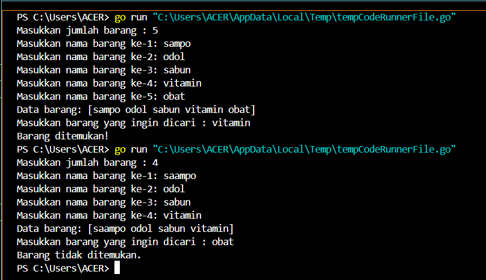
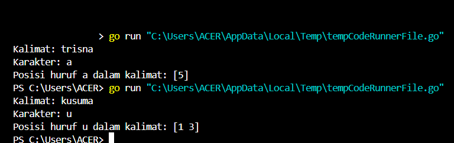
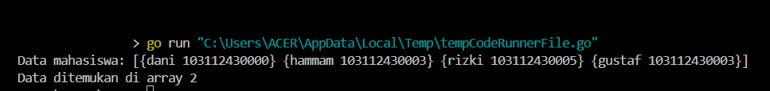
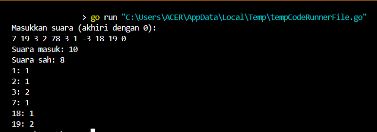
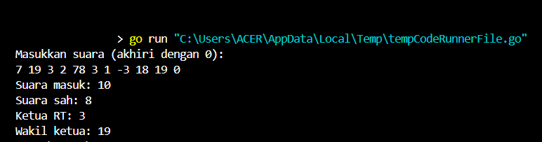
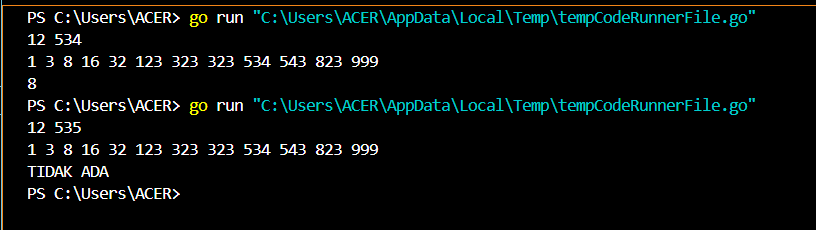

<h1 align="center">Laporan Praktikum Modul 11 <br>Pencarian Nilai Acak Pada Himpunan Data</h1>
<p align="center">TRISNA KUSUMA RAMADHANY - 103112400277</p>

# Dasar Teori
Pencarian Nilai Acak pada Himpunan Data mencakup dua algoritma utama, yaitu Sequential Search dan Binary Search. Sequential Search atau pencarian sekuensial dilakukan dengan memeriksa setiap elemen dalam array satu per satu hingga elemen yang dicari ditemukan atau seluruh data telah diperiksa. Algoritma ini cocok digunakan pada data yang tidak terurut. Sementara itu, Binary Search adalah algoritma yang lebih efisien untuk mencari data dalam array yang sudah terurut, dengan cara membagi ruang pencarian menjadi dua bagian dan memeriksa elemen tengah untuk menentukan arah pencarian selanjutnya. Binary search hanya akan berjalan dengan benar jika data terurut sesuai dengan kriteria pencarian, baik secara ascending maupun descending. Kedua metode ini juga dapat diterapkan pada array bertipe data dasar maupun struct, dengan penyesuaian pada field yang digunakan untuk pencarian​.

---
# Guided

## Soal 1
```go
package main

import "fmt"

type array []string

func dataBarang(n int) array {
	var barang string
	var arrayBarang array

	for i := 0; i < n; i++ {
		fmt.Print("Masukkan nama barang ke-", i+1, ": ")
		fmt.Scan(&barang)
		arrayBarang = append(arrayBarang, barang)
	}
	return arrayBarang
}

func cariArray(arrayBarang array, x string) bool {
	for i := 0; i < len(arrayBarang); i++ {
		if arrayBarang[i] == x {
			return true
		}
	}
	return false
}

func main() {
	var n int
	var x string

	fmt.Print("Masukkan jumlah barang : ")
	fmt.Scan(&n)

	data := dataBarang(n)
	fmt.Println("Data barang:", data)

	fmt.Print("Masukkan barang yang ingin dicari : ")
	fmt.Scan(&x)

	barang := cariArray(data, x)

	if barang {
		fmt.Println("Barang ditemukan!")
	} else {
		fmt.Println("Barang tidak ditemukan.")
	}
}
```

### Penjelasan
Program ini diawali dengan meminta pengguna memasukkan jumlah barang yang akan diinputkan. Setelah jumlah ditentukan, program akan mengumpulkan nama-nama barang sesuai jumlah yang dimasukkan melalui fungsi dataBarang, yang menyimpan data dalam bentuk array bertipe string. Selanjutnya, pengguna diminta untuk memasukkan nama barang yang ingin dicari. Proses pencarian dilakukan dengan fungsi cariArray, yang akan memeriksa satu per satu elemen dalam array untuk mencocokkan dengan input barang yang dicari. Jika barang ditemukan, program akan menampilkan pesan bahwa barang ditemukan; jika tidak, akan ditampilkan bahwa barang tidak ditemukan.

---
## Soal 2
```go
package main

import "fmt"

func pencarianHuruf(kalimat string, karakter string) []int {
	var posisi []int

	for i := 0; i < len(kalimat); i++ {
		if kalimat[i] == karakter[0] {
			posisi = append(posisi, i)
		}
	}
	return posisi
}
func main() {

	var kalimat, karakter string

	fmt.Print("Kalimat: ")
	fmt.Scan(&kalimat)

	fmt.Print("Karakter: ")
	fmt.Scan(&karakter)

	posisi := pencarianHuruf(kalimat, karakter)

	if len(posisi) > 0 {
		fmt.Println("Posisi huruf", karakter, "dalam kalimat:", posisi)
	} else {
		fmt.Println("Karakter", karakter, "tidak ditemukan dalam kalimat.")
	}
}
```

### Penjelasan
Program ini dimulai dengan meminta pengguna memasukkan sebuah kalimat dan satu karakter yang ingin dicari. Setelah input diterima, program menjalankan fungsi pencarianHuruf yang akan memeriksa setiap karakter dalam kalimat dan mencatat posisi indeks dari karakter yang sesuai dengan input pengguna. Hasil dari pencarian tersebut dikembalikan dalam bentuk slice berisi indeks-indeks kemunculan karakter. Jika karakter ditemukan dalam kalimat, program akan menampilkan semua posisi kemunculannya; jika tidak ditemukan, akan ditampilkan pesan bahwa karakter tidak ada dalam kalimat.

---
## Soal 3
```go
package main

import "fmt"

type Mahasiswa struct {
	nama string
	nim  string
}

func binarySearch(mahasiswa []Mahasiswa, nimCari string) int {
	kiri := 0
	kanan := len(mahasiswa) - 1

	for kiri <= kanan {
		mid := (kiri + kanan) / 2

		if mahasiswa[mid].nim == nimCari {
			return mid
		} else if mahasiswa[mid].nim < nimCari {
			kiri = mid + 1
		} else {
			kanan = mid - 1
		}
	}

	return -1
}

func main() {
	var X string

	mahasiswa := []Mahasiswa{
		{nama: "Adi", nim: "103112430000"},
		{nama: "Faiz", nim: "103112430001"},
		{nama: "Nanda", nim: "103112430002"},
		{nama: "Ibang", nim: "103112430003"},
	}
	X = "103112430002"

	fmt.Println("Data mahasiswa:", mahasiswa)

	index := binarySearch(mahasiswa, X)

	if index != -1 {
		fmt.Printf("Data ditemukan di array %d\n", index)
	} else {
		fmt.Println("Mahasiswa dengan NIM tersebut tidak ditemukan.")
	}
}
```

### Penjelasan
Program ini menyimpan data beberapa mahasiswa dalam bentuk slice struct yang terdiri dari nama dan NIM. Pengguna dapat mencari data mahasiswa berdasarkan NIM yang dimasukkan melalui proses pencarian menggunakan algoritma binary search. Fungsi binarySearch membandingkan nilai NIM yang dicari dengan NIM yang ada di posisi tengah array dan terus mempersempit pencarian ke kiri atau kanan sampai ditemukan atau data habis. Karena menggunakan binary search, data mahasiswa harus dalam keadaan terurut berdasarkan NIM. Jika NIM ditemukan, program akan menampilkan indeks posisi dalam array; jika tidak, akan muncul pesan bahwa data mahasiswa tidak ditemukan.

---
# Unguided
## Soal 1
> Pada pemilihan ketua RT yang baru saja berlangsung, terdapat 20 calon ketua yang bertanding memperebutkan suara warga. Perhitungan suara dapat segera dilakukan karena warga cukup mengisi formulir dengan nomor dari calon ketua RT yang dipilihnya. Seperti biasa, selalu ada pengisian yang tidak tepat atau dengan nomor pilihan di luar yang tersedia, sehingga data juga harus divalidasi. Tugas Anda untuk membuat program mencari siapa yang memenangkan pemilihan ketua RT. Buatlah program pilkart yang akan membaca, memvalidasi, dan menghitung suara yang diberikan dalam pemilihan ketua RT tersebut. 
> Masukan hanya satu baris data saja, berisi bilangan bulat valid yang kadang tersisipi dengan data tidak valid. Data valid adalah integer dengan nilai di antara 1 s.d. 20 (inklusif). Data berakhir jika ditemukan sebuah bilangan dengan nilai 0. 
> Keluaran dimulai dengan baris berisi jumlah data suara yang terbaca, diikuti baris yang berisi berapa banyak suara yang valid. Kemudian sejumlah baris yang mencetak data para calon apa saja yang mendapatkan suara.

```go
package main

import "fmt"

const maxCalon = 20

func inputSuara() ([]int, int) {
	var suara int
	var input []int

	fmt.Println("Masukkan suara (akhiri dengan 0):")
	for {
		fmt.Scan(&suara)
		if suara == 0 {
			break
		}
		input = append(input, suara)
	}

	return input, len(input)
}

func hitungSuara(input []int, totalMasuk int, perolehan *[]int) int {
	var totalSah int
	for j := 0; j < totalMasuk; j++ {
		s := input[j]
		if s >= 1 && s <= maxCalon {
			(*perolehan)[s]++
			totalSah++
		}
	}
	return totalSah
}

func tampilkanHasil(totalMasuk int, totalSah int, perolehan []int) {
	fmt.Printf("Suara masuk: %d\n", totalMasuk)
	fmt.Printf("Suara sah: %d\n", totalSah)

	for k := 1; k <= maxCalon; k++ {
		if perolehan[k] > 0 {
			fmt.Printf("%d: %d\n", k, perolehan[k])
		}
	}
}

func main() {
	var perolehan = make([]int, maxCalon+1)

	input, totalMasuk := inputSuara()
	totalSah := hitungSuara(input, totalMasuk, &perolehan)
	tampilkanHasil(totalMasuk, totalSah, perolehan)
}
```

### Penjelasan
Program ini digunakan untuk merekap hasil pemilihan ketua RT dengan maksimal 20 calon. Program dimulai dengan meminta pengguna memasukkan suara dalam bentuk angka, yang berakhir ketika pengguna memasukkan angka 0. Suara-suara yang masuk disimpan dalam slice, lalu dihitung jumlah suara sah menggunakan fungsi hitungSuara, yang hanya menghitung angka antara 1 hingga 20 sebagai suara valid dan mencatat perolehan masing-masing calon dalam array perolehan. Setelah itu, program menampilkan total suara yang masuk, jumlah suara sah, dan jumlah suara yang diperoleh oleh masing-masing calon yang mendapatkan suara, melalui fungsi tampilkanHasil.

---
## Soal 2
>Berdasarkan program sebelumnya, buat program pilkart yang mencari siapa pemenang pemilihan ketua RT. Sekaligus juga ditentukan bahwa wakil ketua RT adalah calon yang mendapatkan suara terbanyak kedua. Jika beberapa calon mendapatkan suara terbanyak yang sama, ketua terpilih adalah dengan nomor peserta yang paling kecil dan wakilnya dengan nomor peserta terkecil berikutnya. Masukan hanya satu baris data saja, berisi bilangan bulat valid yang kadang tersisipi dengan data tidak valid. Data valid adalah bilangan bulat dengan nilai di antara 1 s.d. 20 (inklusif). Data berakhir jika ditemukan sebuah bilangan dengan nilai 0. Keluaran dimulai dengan baris berisi jumlah data suara yang terbaca, diikuti baris yang berisi berapa banyak suara yang valid. Kemudian tercetak calon nomor berapa saja yang menjadi pasangan ketua RT dan wakil ketua RT yang baru.

```go
package main

import "fmt"

const maxCalon = 20

func inputSuara() ([]int, int) {
	var suara int
	var input []int

	fmt.Println("Masukkan suara (akhiri dengan 0):")
	for {
		fmt.Scan(&suara)
		if suara == 0 {
			break
		}
		input = append(input, suara)
	}

	return input, len(input)
}

func hitungSuara(input []int, totalMasuk int, perolehan []int) int {
	var totalSah int
	for j := 0; j < totalMasuk; j++ {
		s := input[j]
		if s >= 1 && s <= maxCalon {
			perolehan[s]++
			totalSah++
		}
	}
	return totalSah
}

func tampilkanHasil(totalMasuk int, totalSah int) {
	fmt.Printf("Suara masuk: %d\n", totalMasuk)
	fmt.Printf("Suara sah: %d\n", totalSah)
}

func cariKetuaWakil(perolehan []int) (int, int) {
	var ketua, wakil int
	var max1, max2 int

	for i := 1; i <= maxCalon; i++ {
		suara := perolehan[i]
		if suara > max1 {
			max2 = max1
			wakil = ketua

			max1 = suara
			ketua = i
		} else if suara == max1 && i < ketua {
			max2 = max1
			wakil = ketua

			ketua = i
		} else if suara > max2 {
			max2 = suara
			wakil = i
		} else if suara == max2 && i < wakil && i != ketua {
			wakil = i
		}
	}
	return ketua, wakil
}

func main() {
	perolehan := make([]int, maxCalon+1)

	input, totalMasuk := inputSuara()
	totalSah := hitungSuara(input, totalMasuk, perolehan)

	tampilkanHasil(totalMasuk, totalSah)

	ketua, wakil := cariKetuaWakil(perolehan)
	if totalSah > 0 {
		fmt.Printf("Ketua RT: %d\n", ketua)
		if wakil > 0 {
			fmt.Printf("Wakil ketua: %d\n", wakil)
		}
	}
}
```

### Penjelasan
Program ini lanjutan dari program soal nomor 1 dan bertujuan untuk merekap dan menentukan hasil pemilihan ketua serta wakil ketua RT dari maksimal 20 calon. Program dimulai dengan meminta pengguna memasukkan suara secara berurutan hingga memasukkan angka 0 sebagai penanda akhir input. Suara-suara yang masuk dihitung jumlah totalnya dan diproses menggunakan fungsi hitungSuara untuk memisahkan suara sah, yaitu angka dari 1 sampai 20, serta mencatat perolehan suara masing-masing calon. Fungsi tampilkanHasil akan menampilkan jumlah suara yang masuk dan yang sah. Selanjutnya, program menjalankan fungsi cariKetuaWakil untuk menentukan ketua dan wakil ketua RT berdasarkan jumlah suara terbanyak pertama dan kedua, dengan prioritas pada calon bernomor lebih kecil jika terjadi jumlah suara yang sama. Hasil akhir berupa nomor calon ketua dan wakil ketua ditampilkan jika ada suara sah yang masuk.

---
## Soal 3
>Diberikan n data integer positif dalam keadaan terurut membesar dan sebuah integer lain k, apakah bilangan k tersebut ada dalam daftar bilangan yang diberikan? Jika ya, berikan indeksnya, jika tidak sebutkan "TIDAK ADA". Masukan terdiri dari dua baris. Baris pertama berisi dua buah integer positif, yaitu n dan k. n menyatakan banyaknya data, dimana 1 < n <= 1000000. k adalah bilangan yang ingin dicari. Baris kedua berisi n buah data integer positif yang sudah terurut membesar. Keluaran terdiri dari satu baris saja, yaitu sebuah bilangan yang menyatakan posisi data yang dicari (k) dalam kumpulan data yang diberikan. Posisi data dihitung dimulai dari angka 0. Atau memberikan keluaran "TIDAK ADA" jika data k tersebut tidak ditemukan dalam kumpulan. 

```go
package main

import "fmt"

const NMAX = 1000000

var data [NMAX]int

func isiArray(n int) {
	for i := 0; i < n; i++ {
		fmt.Scan(&data[i])
	}
}

func posisi(n, k int) int {
	low := 0
	high := n - 1

	for low <= high {
		mid := (low + high) / 2
		if data[mid] == k {
			return mid
		} else if data[mid] < k {
			low = mid + 1
		} else {
			high = mid - 1
		}
	}

	return -1
}

func main() {
	var n, k int
	fmt.Scan(&n, &k)

	isiArray(n)

	idx := posisi(n, k)
	if idx == -1 {
		fmt.Println("TIDAK ADA")
	} else {
		fmt.Println(idx)
	}
}
```

### Penjelasan
Program ini bertujuan untuk mencari apakah sebuah angka tertentu terdapat dalam kumpulan angka yang telah dimasukkan oleh pengguna. Pertama, pengguna diminta untuk memasukkan sejumlah data angka, lalu diikuti dengan angka yang ingin dicari. Program kemudian menyimpan seluruh angka tersebut dan mulai melakukan pencarian menggunakan metode binary search, yaitu teknik pencarian cepat dengan membandingkan angka tengah dari kumpulan data yang sudah terurut. Jika angka yang dicari ditemukan dalam kumpulan, program akan menampilkan posisi atau urutan kemunculannya. Namun, jika tidak ditemukan, program akan menampilkan pesan bahwa angka tersebut tidak ada dalam data yang dimasukkan.
