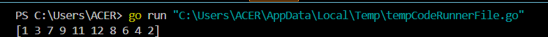
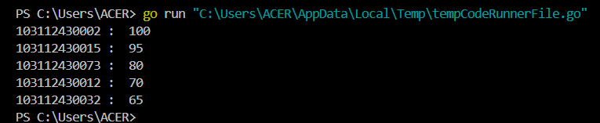
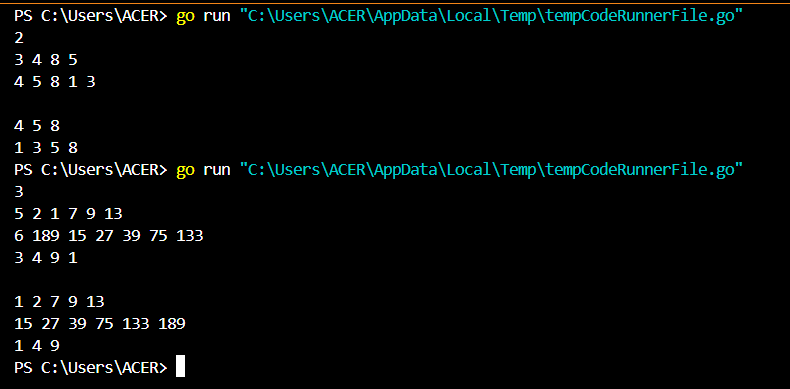
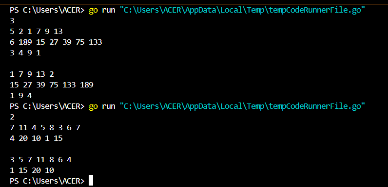
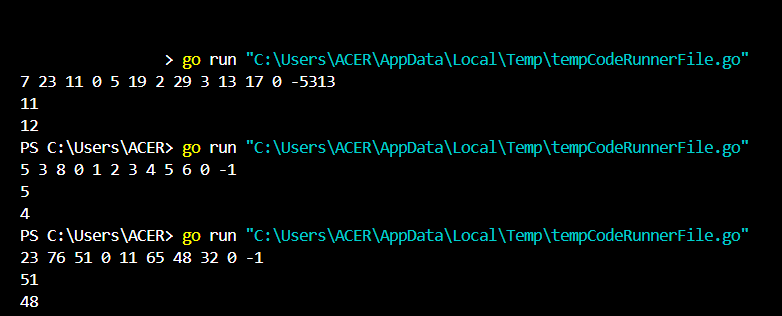
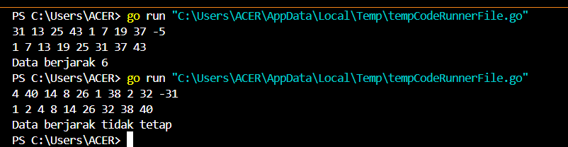
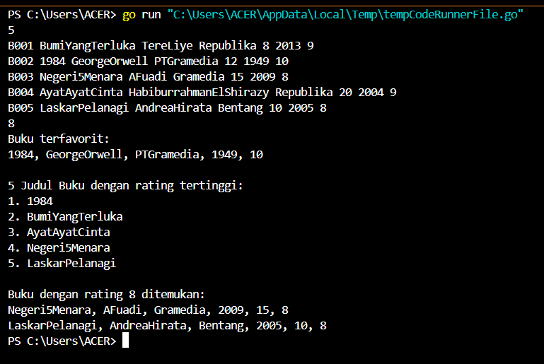

<h1 align="center">Laporan Praktikum Modul 12 & 13 <br>Pengurutan Data</h1>
<p align="center">TRISNA KUSUMA RAMADHANY - 103112400277</p>
# Dasar Teori
Terdapat dua metode pengurutan data, yaitu Selection Sort dan Insertion Sort. Pada Selection Sort, ide utamanya adalah mencari nilai ekstrim dari kumpulan data dan menukarnya dengan posisi yang tepat, dimulai dari data yang paling kiri. Proses ini diulang hingga seluruh data terurut. Sedangkan pada Insertion Sort, algoritma ini bekerja dengan menyisipkan nilai baru ke dalam posisi yang tepat pada data yang sudah terurut, menggeser data yang lebih besar ke kanan. Kedua algoritma ini digunakan untuk mengurutkan array, dengan Selection Sort lebih efisien pada data kecil, sementara Insertion Sort lebih cepat untuk data yang hampir terurut.

---
# Guided

## Soal 1
>Diberikan n bilangan bulat positif. Buat program untuk mengurutkan angka ganjil secara membesar (ascending) dan angka genap secara mengecil (descending), lalu gabungkan hasilnya dengan ganjil duluan. Gunakan selection sort dalam proses pengurutan.
>Masukan:
>Baris pertama berisi bilangan bulat n (1 ≤ n ≤ 100).
>Baris kedua berisi n bilangan bulat positif.
>
>Keluaran:
>Satu baris berisi angka ganjil terurut membesar diikuti angka genap terurut mengecil.
>
>Contoh Masukan:
>10
>12 7 3 2 9 6 8 1 11 4
>Contoh Keluaran:
>1 3 7 9 11 12 8 6 4 2

```go
package main

import "fmt"

func sorting(arr []int) []int {
	ganjil := []int{}
	genap := []int{}

	for i := 0; i < len(arr); i++ {
		if arr[i]%2 == 0 {
			genap = append(genap, arr[i])
		} else {
			ganjil = append(ganjil, arr[i])
		}
	}

	for i := 0; i < len(ganjil)-1; i++ {
		for j := i + 1; j < len(ganjil); j++ {
			if ganjil[j] < ganjil[i] {
				ganjil[i], ganjil[j] = ganjil[j], ganjil[i]
			}
		}
	}

	for i := 0; i < len(genap)-1; i++ {
		for j := i + 1; j < len(genap); j++ {
			if genap[j] > genap[i] {
				genap[i], genap[j] = genap[j], genap[i]
			}
		}
	}
	return append(ganjil, genap...)
}

func main() {
	angka := []int{12, 7, 3, 2, 9, 6, 8, 1, 11, 4}
	angkaTerurut := sorting(angka)
	fmt.Println(angkaTerurut)
}
```

### Penjelasan
Program ini dimulai dengan mendefinisikan sebuah array berisi angka yang akan diproses. Fungsi sorting kemudian dipanggil untuk memisahkan angka ganjil dan genap dalam array tersebut. Angka ganjil disimpan dalam array ganjil dan angka genap dalam array genap. Selanjutnya, setiap array akan diurutkan secara terpisah: array ganjil diurutkan secara menaik, sementara array genap diurutkan secara menurun. Setelah kedua array terurut, keduanya digabungkan menjadi satu array, dengan angka ganjil terlebih dahulu diikuti oleh angka genap. Hasil akhirnya adalah array yang telah terurut sesuai dengan aturan yang telah ditentukan, dan program menampilkan hasil array yang sudah diurutkan tersebut.

---
## Soal 2
>Sebuah kelas memiliki sejumlah siswa yang telah mengikuti ujian. Tugas Anda adalah membuat program yang membaca nilai-nilai ujian siswa yang disimpan dalam struct berisi nim dan nilai, kemudian mengurutkan nilai-nilai tersebut dari yang tertinggi ke yang terendah menggunakan insertion sort. Masukan: Baris pertama berisi sebuah bilangan bulat n (1 ≤ n ≤ 100), yang menyatakan jumlah siswa. Baris kedua berisi n bilangan bulat, masing-masing mewakili nilai ujian siswa (0–100).Keluaran: Satu baris yang berisi nilai-nilai ujian yang sudah terurut dari yang terbesar ke yang terkecil. 
>
>Contoh Masukan: 
>6 75 60 90 80 100 65 
>
>Contoh Keluaran: 
>100 90 80 75 65 60
```go
package main

import "fmt"

type identitas struct {
	nama  string
	nilai int
}

func nilaiujian(arr []identitas) {
	var temp identitas
	for i := 1; i < len(arr); i++ {
		temp = arr[i]
		j := i

		for j > 0 && temp.nilai > arr[j-1].nilai {
			arr[j] = arr[j-1]
			j--
		}

		arr[j] = temp
	}
}

func main() {
	orang := []identitas{
		{"103112430032", 75},
		{"103112430002", 90},
		{"103112430073", 85},
		{"103112430012", 95},
		{"103112430015", 80},
	}

	nilaiujian(orang)

	for i := 0; i < len(orang); i++ {
		fmt.Println(orang[i].nama, ": ", orang[i].nilai)
	}
}
```

### Penjelasan
Program ini dimulai dengan mendefinisikan struct identitas yang menyimpan nama dan nilai siswa. Fungsi nilaiujian menggunakan algoritma insertion sort untuk mengurutkan array siswa berdasarkan nilai ujian secara menurun. Di dalam main, data siswa dimasukkan ke dalam array, kemudian fungsi nilaiujian dipanggil untuk mengurutkan data. Setelah itu, program mencetak hasil nama siswa dan nilai mereka yang sudah terurut.

---
# Unguided

# A. Selection Short
## Soal 1 
>Hercules, preman terkenal seantero ibukota, memiliki kerabat di banyak daerah. Tentunya Hercules sangat suka mengunjungi semua kerabatnya itu. Diberikan masukan nomor rumah dari semua kerabatnya di suatu daerah, buatlah program rumahkerabat yang akan menyusun nomor-nomor rumah kerabatnya secara terurut membesar menggunakan algoritma selection sort. Masukan dimulai dengan sebuah integer 𝒏 (0 < n < 1000), banyaknya daerah kerabat Hercules tinggal. Isi 𝒏 baris berikutnya selalu dimulai dengan sebuah integer 𝒎 (0 < m < 1000000) yang menyatakan banyaknya rumah kerabat di daerah tersebut, diikuti dengan rangkaian bilangan bulat positif, nomor rumah para kerabat. Keluaran terdiri dari n baris, yaitu rangkaian rumah kerabatnya terurut membesar di masingmasing daerah.

```go
package main

import "fmt"

func selectionSort(arr []int) {
	for i := 0; i < len(arr)-1; i++ {
		idxMin := i
		for j := i + 1; j < len(arr); j++ {
			if arr[j] < arr[idxMin] {
				idxMin = j
			}
		}
		arr[i], arr[idxMin] = arr[idxMin], arr[i]
	}
}

func bacaInput() [][]int {
	var n, m int
	fmt.Scan(&n)
	semuaDaerah := make([][]int, n)

	for i := 0; i < n; i++ {
		fmt.Scan(&m)
		rumah := make([]int, m)
		for j := 0; j < m; j++ {
			fmt.Scan(&rumah[j])
		}
		selectionSort(rumah)
		semuaDaerah[i] = rumah
	}

	return semuaDaerah
}

func tampilkanOutput(semuaDaerah [][]int) {
	for i := 0; i < len(semuaDaerah); i++ {
		for j := 0; j < len(semuaDaerah[i]); j++ {
			if j > 0 {
				fmt.Print(" ")
			}
			fmt.Print(semuaDaerah[i][j])
		}
		fmt.Println()
	}
}

func main() {
	daerah := bacaInput()
	println()
	tampilkanOutput(daerah)
}
```

### Penjelasan
Program ini bertujuan untuk mengurutkan nomor rumah kerabat Hercules di setiap daerah menggunakan algoritma selection sort secara menaik. Input dimulai dengan jumlah daerah (n), lalu setiap daerah diikuti oleh jumlah rumah (m) dan daftar nomor rumah. Fungsi bacaInput membaca semua input, menyimpan data setiap daerah dalam slice dua dimensi, dan langsung mengurutkannya menggunakan selectionSort. Fungsi selectionSort sendiri mencari elemen terkecil dari bagian yang belum terurut dan menukarnya ke posisi yang tepat. Setelah semua data diurutkan, fungsi tampilkanOutput mencetak nomor rumah yang sudah terurut untuk masing-masing daerah.

---
## Soal 2
>Belakangan diketahui ternyata Hercules itu tidak berani menyeberang jalan, maka selalu diusahakan agar hanya menyeberang jalan sesedikit mungkin, hanya diujung jalan. Karena nomor rumah sisi kiri jalan selalu ganjil dan sisi kanan jalan selalu genap, maka buatlah program kerabat dekat yang akan menampilkan nomor rumah mulai dari nomor yang ganjil lebih dulu terurut membesar dan kemudian menampilkan nomor rumah dengan nomor genap terurut mengecil. Format Masukan masih persis sama seperti sebelumnya. Keluaran terdiri dari n baris, yaitu rangkaian rumah kerabatnya terurut membesar untuk nomor ganjil, diikuti dengan terurut mengecil untuk nomor genap, di masing-masing daerah.
>Keterangan: 
>Terdapat 3 daerah dalam contoh masukan. Baris kedua berisi campuran bilangan ganjil dan genap. Baris berikutnya hanya berisi bilangan ganjil, dan baris terakhir hanya berisi bilangan genap. 
>
>Petunjuk:
>- Waktu pembacaan data, bilangan ganjil dan genap dipisahkan ke dalam dua array yang berbeda, untuk kemudian masing-masing diurutkan tersendiri. 
>- Atau, tetap disimpan dalam satu array, diurutkan secara keseluruhan. Tetapi pada waktu pencetakan, mulai dengan mencetak semua nilai ganjil lebih dulu, kemudian setelah selesai cetaklah semua nilai genapnya.

```go
package main

import "fmt"

func selectionSortAsc(arr []int) {
	for i := 0; i < len(arr)-1; i++ {
		idxMin := i
		for j := i + 1; j < len(arr); j++ {
			if arr[j] < arr[idxMin] {
				idxMin = j
			}
		}
		arr[i], arr[idxMin] = arr[idxMin], arr[i]
	}
}

func selectionSortDesc(arr []int) {
	for i := 0; i < len(arr)-1; i++ {
		idxMax := i
		for j := i + 1; j < len(arr); j++ {
			if arr[j] > arr[idxMax] {
				idxMax = j
			}
		}
		arr[i], arr[idxMax] = arr[idxMax], arr[i]
	}
}

func bacaInput() [][]int {
	var jumlahDaerah, jumlahRumah int
	fmt.Scan(&jumlahDaerah)
	semuaDaerah := make([][]int, jumlahDaerah)

	for i := 0; i < jumlahDaerah; i++ {
		fmt.Scan(&jumlahRumah)
		ganjil := []int{}
		genap := []int{}

		for j := 0; j < jumlahRumah; j++ {
			var nomor int
			fmt.Scan(&nomor)
			if nomor%2 == 0 {
				genap = append(genap, nomor)
			} else {
				ganjil = append(ganjil, nomor)
			}
		}

		selectionSortAsc(ganjil)
		selectionSortDesc(genap)

		semuaDaerah[i] = append(ganjil, genap...)
	}

	return semuaDaerah
}

func tampilkanOutput(daerah [][]int) {
	for i := 0; i < len(daerah); i++ {
		for j := 0; j < len(daerah[i]); j++ {
			if j > 0 {
				fmt.Print(" ")
			}
			fmt.Print(daerah[i][j])
		}
		fmt.Println()
	}
}

func main() {
	data := bacaInput()
	fmt.Println()
	tampilkanOutput(data)
}
```

### Penjelasan
Program ini merupakan lanjutan dari program sebelumnya yang dimodifikasi agar Hercules hanya perlu menyeberang jalan sesedikit mungkin. Setiap nomor rumah yang dimasukkan akan dipisah menjadi dua yaitu ganjil dan genap. Nomor ganjil diurutkan naik (menaik), sedangkan nomor genap diurutkan turun (menurun) menggunakan algoritma selection sort. Setelah diurutkan, keduanya digabung dan ditampilkan per daerah: ganjil dulu, lalu genap. Tujuannya agar urutan kunjungan mengikuti sisi jalan yang sama lebih dulu sebelum menyeberang.

---
## Soal 3
>Kompetisi pemrograman yang baru saja berlalu diikuti oleh 17 tim dari berbagai perguruan tinggi ternama. Dalam kompetisi tersebut, setiap tim berlomba untuk menyelesaikan sebanyak mungkin problem yang diberikan. Dari 13 problem yang diberikan, ada satu problem yang menarik. Problem tersebut mudah dipahami, hampir semua tim mencoba untuk menyelesaikannya, tetapi hanya 3 tim yang berhasil. Apa sih problemnya? "Median adalah nilai tengah dari suatu koleksi data yang sudah terurut. Jika jumlah data genap, maka nilai median adalah rerata dari kedua nilai tengahnya. Pada problem ini, semua data merupakan bilangan bulat positif, dan karenanya rerata nilai tengah dibulatkan ke bawah." Buatlah program median yang mencetak nilai median terhadap seluruh data yang sudah terbaca, jika data yang dibaca saat itu adalah 0. Masukan berbentuk rangkaian bilangan bulat. Masukan tidak akan berisi lebih dari 1000000 data, tidak termasuk bilangan 0. Data 0 merupakan tanda bahwa median harus dicetak, tidak termasuk data yang dicari mediannya. Data masukan diakhiri dengan bilangan bulat -5313. Keluaran adalah median yang diminta, satu data per baris.
>
>Keterangan: Sampai bilangan 0 yang pertama, data terbaca adalah 7 23 11, setelah tersusun: 7 11 23, maka median saat itu adalah 11. Sampai bilangan 0 yang kedua, data adalah 7 23 11 5 19 2 29 3 13 17, setelah tersusun diperoleh: 2 3 5 7 11 13 17 19 23 29. Karena ada 10 data, genap, maka median adalah (11+13)/2=12. 
>
>Petunjuk: Untuk setiap data bukan 0 (dan bukan marker -5313541) simpan ke dalam array, Dan setiap kali menemukan bilangan 0, urutkanlah data yang sudah tersimpan dengan menggunakan metode insertion sort dan ambil mediannya.

```go
package main

import "fmt"

func selectionSort(arr []int) {
	var i, j, minIdx, temp int
	for i = 0; i < len(arr)-1; i++ {
		minIdx = i
		for j = i + 1; j < len(arr); j++ {
			if arr[j] < arr[minIdx] {
				minIdx = j
			}
		}
		temp = arr[i]
		arr[i] = arr[minIdx]
		arr[minIdx] = temp
	}
}

func hitungMedian(data []int) int {
	var n, tengah, median int
	n = len(data)
	selectionSort(data)

	if n%2 == 1 {
		tengah = n / 2
		median = data[tengah]
	} else {
		tengah = n / 2
		median = (data[tengah-1] + data[tengah]) / 2
	}
	return median
}

func main() {
	var input int
	var data []int
	var salinan []int
	var hasil int

	for {
		fmt.Scan(&input)

		if input < 0 {
			break
		} else if input == 0 {
			if len(data) > 0 {
				salinan = make([]int, len(data))
				copy(salinan, data)
				hasil = hitungMedian(data)
				fmt.Println(hasil)
			}
		} else {
			data = append(data, input)
		}
	}
}
```

### Penjelasan
Program ini dibuat untuk menyelesaikan sebuah problem kompetisi pemrograman yang menantang peserta untuk menghitung median dari sekumpulan bilangan bulat positif yang terus bertambah. Setiap angka yang dibaca dari input akan disimpan, kecuali angka 0 dan bilangan negatif. Ketika angka 0 dibaca, program akan menghitung median dari seluruh data yang telah tersimpan hingga saat itu. Median dihitung setelah data diurutkan menggunakan metode selection sort. Jika jumlah data ganjil, maka median adalah nilai di tengah. Jika jumlah data genap, maka median adalah rata-rata dari dua nilai tengah, namun dibulatkan ke bawah (mengikuti aturan kompetisi). Bilangan negatif menandakan akhir dari proses input. Dengan pendekatan ini, program dapat menghitung median berkali-kali berdasarkan urutan data yang terus bertambah secara dinamis.

---
# A. Insertion Short
## Soal 1
>Buatlah sebuah program yang digunakan untuk membaca data integer seperti contoh yang diberikan di bawah ini, kemudian diurutkan (menggunakan metoda insertion sort), dan memeriksa apakah data yang terurut berjarak sama terhadap data sebelumnya. Masukan terdiri dari sekumpulan bilangan bulat yang diakhiri oleh bilangan negatif. Hanya bilangan non negatif saja yang disimpan ke dalam array. Keluaran terdiri dari dua baris. Baris pertama adalah isi dari array setelah dilakukan pengurutan, sedangkan baris kedua adalah status jarak setiap bilangan yang ada di dalam array. "Data berjarak x" atau "data berjarak tidak tetap".

```go
package main

import "fmt"

func urutkanArray(arr []int) {
	for i := 1; i < len(arr); i++ {
		kunci := arr[i]
		j := i - 1
		for j >= 0 && arr[j] > kunci {
			arr[j+1] = arr[j]
			j = j - 1
		}
		arr[j+1] = kunci
	}
}

func periksaJarak(arr []int) (bool, int) {
	if len(arr) < 2 {
		return true, 0
	}
	jarak := arr[1] - arr[0]
	for i := 2; i < len(arr); i++ {
		if arr[i]-arr[i-1] != jarak {
			return false, 0
		}
	}
	return true, jarak
}

func main() {
	var angka int
	var data []int

	for {
		fmt.Scan(&angka)
		if angka < 0 {
			break
		}
		data = append(data, angka)
	}

	urutkanArray(data)

	for i := 0; i < len(data); i++ {
		if i > 0 {
			fmt.Print(" ")
		}
		fmt.Print(data[i])
	}
	fmt.Println()

	berjarakTetap, jarak := periksaJarak(data)

	if berjarakTetap {
		fmt.Printf("Data berjarak %d\n", jarak)
	} else {
		fmt.Println("Data berjarak tidak tetap")
	}
}
```

### Penjelasan
Program ini menggunakan algoritma insertion sort untuk mengurutkan deretan bilangan bulat yang dimasukkan oleh pengguna hingga ditemukan angka negatif sebagai penanda akhir input. Setelah data diurutkan, program akan mencetak deretan angka tersebut dan memeriksa apakah setiap pasangan bilangan memiliki selisih (jarak) yang tetap. Jika semua selisih antar elemen sama, maka program menyatakan bahwa data berjarak tetap beserta nilai jaraknya, jika tidak, program akan mencetak bahwa data tidak berjarak tetap.

---
## Soal 2
>Sebuah program perpustakaan digunakan untuk mengelola data buku di dalam suatu perpustakaan. Misalnya terdefinisi struct dan array seperti berikut ini:
```
const nMax : integer = 7919
type Buku = <
 id, judul, penulis, penerbit : string
 eksemplar, tahun, rating : integer >
type DaftarBuku = array [ 1..nMax] of Buku
Pustaka : DaftarBuku
nPustaka: integer
```
>Masukan terdiri dari beberapa baris. Baris pertama adalah bilangan bulat N yang menyatakan banyaknya data buku yang ada di dalam perpustakaan. N baris berikutnya, masing-masingnya adalah data buku sesuai dengan atribut atau field pada struct. Baris terakhir adalah bilangan bulat yang menyatakan rating buku yang akan dicari. Keluaran terdiri dari beberapa baris. Baris pertama adalah data buku terfavorit, baris kedua adalah lima judul buku dengan rating tertinggi, selanjutnya baris terakhir adalah data buku yang dicari sesuai rating yang diberikan pada masukan baris terakhir.
```
procedure DaftarkanBuku(in/out pustaka : DaftarBuku, n : integer)
{I.S. sejumlah n data buku telah siap para piranti masukan
F.S. n berisi sebuah nilai, dan pustaka berisi sejumlah n data buku}

procedure CetakTerfavorit(in pustaka : DaftarBuku, in n : integer)
{I.S. array pustaka berisi n buah data buku dan belum terurut
F.S. Tampilan data buku (judul, penulis, penerbit, tahun)
terfavorit, yaitu memiliki rating tertinggi}

procedure UrutBuku( in/out pustaka : DaftarBuku, n : integer )
{I.S. Array pustaka berisi n data buku
F.S. Array pustaka terurut menurun/mengecil terhadap rating.
Catatan: Gunakan metoda Insertion sort}

procedure Cetak5Terbaru( in pustaka : DaftarBuku, n integer )
{I.S. pustaka berisi n data buku yang sudah terurut menurut rating
F.S. Laporan 5 judul buku dengan rating tertinggi
Catatan: Isi pustaka mungkin saja kurang dari 5}

procedure CariBuku(in pustaka : DaftarBuku, n : integer, r : integer )
{I.S. pustaka berisi n data buku yang sudah terurut menurut rating
F.S. Laporan salah satu buku (judul, penulis, penerbit, tahun,
eksemplar, rating) dengan rating yang diberikan. Jika tidak ada buku
dengan rating yang ditanyakan, cukup tuliskan “Tidak ada buku dengan
rating seperti itu”. Catatan: Gunakan pencarian biner/belah dua.}
```

```go
package main

import "fmt"

const nMax = 7919

type Buku struct {
	id, judul, penulis, penerbit string
	eksemplar, tahun, rating     int
}

type DaftarBuku [nMax]Buku

func daftarkanBuku(pustaka *DaftarBuku, n *int) {
	fmt.Scan(n)
	for i := 0; i < *n; i++ {
		fmt.Scan(&(*pustaka)[i].id, &(*pustaka)[i].judul, &(*pustaka)[i].penulis, &(*pustaka)[i].penerbit, &(*pustaka)[i].eksemplar, &(*pustaka)[i].tahun, &(*pustaka)[i].rating)
	}
}

func cetakTerfavorit(pustaka DaftarBuku, n int) {
	terfavorit := pustaka[0]

	for i := 1; i < n; i++ {
		if pustaka[i].rating > terfavorit.rating {
			terfavorit = pustaka[i]
		}
	}

	fmt.Println("Buku terfavorit:")
	fmt.Printf("%s, %s, %s, %d, %d\n", terfavorit.judul, terfavorit.penulis, terfavorit.penerbit, terfavorit.tahun, terfavorit.rating)
}

func urutBuku(pustaka *DaftarBuku, n int) {
	for i := 1; i < n; i++ {
		temp := (*pustaka)[i]
		j := i - 1
		for j >= 0 && (*pustaka)[j].rating < temp.rating {
			(*pustaka)[j+1] = (*pustaka)[j]
			j--
		}
		(*pustaka)[j+1] = temp
	}
}

func cetak5Terbaru(pustaka DaftarBuku, n int) {
	if n > 5 {
		n = 5
	}

	fmt.Println("\n5 Judul Buku dengan rating tertinggi:")

	for i := 0; i < n; i++ {
		fmt.Printf("%d. %s\n", i+1, pustaka[i].judul)
	}
}

func cariBuku(pustaka DaftarBuku, n, r int) {
	kiri, kanan := 0, n-1
	ditemukan := false
	var foundBooks []Buku

	for kiri <= kanan {
		tengah := (kiri + kanan) / 2
		if pustaka[tengah].rating == r {
			foundBooks = append(foundBooks, pustaka[tengah])
			i := tengah - 1
			for i >= 0 && pustaka[i].rating == r {
				foundBooks = append(foundBooks, pustaka[i])
				i--
			}
			i = tengah + 1
			for i < n && pustaka[i].rating == r {
				foundBooks = append(foundBooks, pustaka[i])
				i++
			}
			ditemukan = true
			break
		} else if pustaka[tengah].rating < r {
			kanan = tengah - 1
		} else {
			kiri = tengah + 1
		}
	}

	if ditemukan {
		fmt.Printf("\nBuku dengan rating %d ditemukan:\n", r)
		for i := 0; i < len(foundBooks); i++ {
			fmt.Printf("%s, %s, %s, %d, %d, %d\n", foundBooks[i].judul, foundBooks[i].penulis, foundBooks[i].penerbit, foundBooks[i].tahun, foundBooks[i].eksemplar, foundBooks[i].rating)
		}
	} else {
		fmt.Println("Tidak ada buku dengan rating seperti itu")
	}
}

func main() {
	var pustaka DaftarBuku
	var nPustaka, ratingCari int

	daftarkanBuku(&pustaka, &nPustaka)
	fmt.Scan(&ratingCari)
	urutBuku(&pustaka, nPustaka)
	cetakTerfavorit(pustaka, nPustaka)
	cetak5Terbaru(pustaka, nPustaka)
	cariBuku(pustaka, nPustaka, ratingCari)
}
```

### Penjelasan
Program ini digunakan untuk mengelola daftar buku dengan informasi seperti ID, judul, penulis, penerbit, eksemplar, tahun terbit, dan rating. Fungsi daftarkanBuku digunakan untuk memasukkan data buku ke dalam array DaftarBuku, sementara urutBuku mengurutkan buku berdasarkan rating tertinggi menggunakan algoritma insertion short. Fungsi cetakTerfavorit menampilkan buku dengan rating tertinggi, dan cetak5Terbaru mencetak lima buku dengan rating tertinggi. Fungsi cariBuku mencari buku dengan rating tertentu dan menampilkan semua buku dengan rating yang sama.
