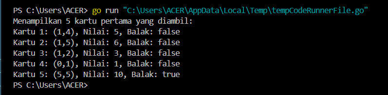
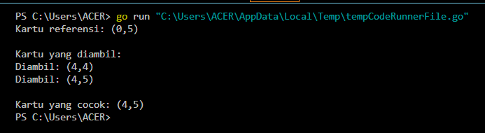
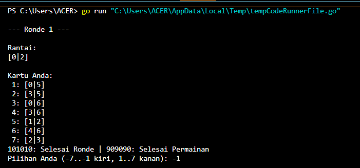
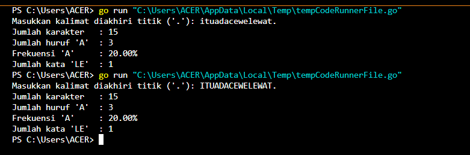

<h1 align="center">Laporan Praktikum Modul 18<br>Mesin Abstrak</h1>
<p align="center">TRISNA KUSUMA RAMADHANY - 103112400277</p>

# Dasar Teori
Mesin abstrak adalah model komputasi yang dibangun di atas mesin komputasi yang sudah ada, dengan menggunakan tipe data dan operasi dasar dari mesin sebelumnya untuk membentuk operasi baru. Konsep ini digunakan dalam pengembangan perangkat lunak. Contoh penerapannya dapat dilihat pada mesin domino, yang memiliki tipe data berupa kartu domino dengan dua sisi bernilai 0 hingga 6 pip, dan operasi dasar seperti mengocok, mengambil, melihat, dan menilai kartu. Setiap kartu bernilai total pip dari kedua sisinya (0–12), tanpa duplikasi (misalnya, kartu 1-4 sama dengan 4-1). Kasus penggunaan mesin domino mencakup pencarian kartu dengan gambar yang sama, pengecekan kartu balak (kedua sisi sama), dan penjumlahan dua kartu menjadi 12. Beberapa permainan yang menggunakan prinsip ini antara lain Gapleh, Kiu-kiu, Luzon, dan Texas 42.

---
# Unguided
## Soal 1
>Implementasi operasi dasar mesin domino sebagai sebuah subprogram: 
>a) Buat tipe data kartu domino (Domino) yang menyimpan informasi 
>➢ gambar (suit) kedua sisi kartu 
>➢ nilai kartu 
>➢ Boolean data yang menyatakan kartu ini balak atau bukan 
>➢ Buat tipe data satu set kartu domino (Dominoes) 
>➢ Array menyimpan 28 kartu Domino 
>➢ Jumlah kartu tersisa dalam array tersebut 
>b) prosedur kocokKartu(Dominoes) 
>c) fungsi ambilKartu(Dominoes) → Domino 
>d) fungsi gambarKartu(Domino,suit int) → int 
>e) fungsi nilaiKartu(Domino) → int

```go
package main

import (
	"fmt"
	"math/rand"
	"time"
)

type Domino struct {
	sisiSatu int
	sisiDua  int
	nilai    int
	balak    bool
}

type Dominoes struct {
	kartu  [28]Domino
	jumlah int
}

func inisialisasiDomino(d *Dominoes) {
	index := 0
	for i := 0; i <= 6; i++ {
		for j := i; j <= 6; j++ {
			k := Domino{
				sisiSatu: i,
				sisiDua:  j,
				nilai:    i + j,
				balak:    i == j,
			}
			d.kartu[index] = k
			index++
		}
	}
	d.jumlah = 28
}

func kocokKartu(d *Dominoes) {
	rand.Seed(time.Now().UnixNano())
	for i := d.jumlah - 1; i > 0; i-- {
		j := rand.Intn(i + 1)
		d.kartu[i], d.kartu[j] = d.kartu[j], d.kartu[i]
	}
}

func ambilKartu(d *Dominoes) Domino {
	if d.jumlah == 0 {
		return Domino{-1, -1, -1, false}
	}
	d.jumlah--
	return d.kartu[d.jumlah]
}

func gambarKartu(k Domino, sisi int) int {
	if sisi == 1 {
		return k.sisiSatu
	} else if sisi == 2 {
		return k.sisiDua
	} else {
		return -1
	}
}

func nilaiKartu(k Domino) int {
	return k.nilai
}

func main() {
	var dominoSet Dominoes

	inisialisasiDomino(&dominoSet)
	kocokKartu(&dominoSet)

	fmt.Println("Menampilkan 5 kartu pertama yang diambil:")
	for i := 0; i < 5; i++ {
		kartu := ambilKartu(&dominoSet)
		fmt.Printf("Kartu %d: (%d,%d), Nilai: %d, Balak: %v\n",
			i+1, kartu.sisiSatu, kartu.sisiDua, nilaiKartu(kartu), kartu.balak)
	}
}
```

### Penjelasan
Program Go ini mendemonstrasikan operasi dasar untuk mengelola satu set kartu domino. Program dimulai dengan mendefinisikan struktur data untuk satu kartu Domino (menyimpan nilai sisiSatu, sisiDua, nilai total, dan status balak) dan satu set Dominoes (berisi array 28 kartu dan jumlah kartu tersisa). Fungsi inisialisasiDomino menciptakan 28 kartu domino unik, kemudian kocokKartu mengacaknya secara acak menggunakan seed berbasis waktu. Fungsi ambilKartu digunakan untuk mengambil satu kartu dari tumpukan, gambarKartu untuk mendapatkan nilai dari sisi tertentu sebuah kartu, dan nilaiKartu untuk mendapatkan nilai total kartu tersebut. Sebagai contoh penggunaan, fungsi main menginisialisasi, mengocok, lalu mengambil dan menampilkan detail lima kartu pertama dari tumpukan, menunjukkan bagaimana fungsi-fungsi dasar ini bekerja bersama.

---
## Soal 2
>Realisasi aksi berikut menggunakan operasi-operasi dasar mesin domino: 
>a) prosedur galiKartu(Dominoes,Domino) yang mengambil kartu dari tumpukan sampai diperoleh kartu dengan gambar (suit) yang sama dengan kartu yang diberikan
>b) fungsi sepasangKartu(Domino,Domino) → boolean; yang memberikan nilai true jika total nilai kartu adalah 12 dan false jika tidak.

```go
package main

import (
	"fmt"
	"math/rand"
	"time"
)

type Domino struct {
	sisiSatu int
	sisiDua  int
	nilai    int
	balak    bool
}

type Dominoes struct {
	kartu  [28]Domino
	jumlah int
}

func inisialisasiDomino(d *Dominoes) {
	index := 0
	for i := 0; i <= 6; i++ {
		for j := i; j <= 6; j++ {
			k := Domino{
				sisiSatu: i,
				sisiDua:  j,
				nilai:    i + j,
				balak:    i == j,
			}
			d.kartu[index] = k
			index++
		}
	}
	d.jumlah = 28
}

func kocokKartu(d *Dominoes) {
	rand.Seed(time.Now().UnixNano())
	for i := d.jumlah - 1; i > 0; i-- {
		j := rand.Intn(i + 1)
		d.kartu[i], d.kartu[j] = d.kartu[j], d.kartu[i]
	}
}

func ambilKartu(d *Dominoes) Domino {
	if d.jumlah == 0 {
		return Domino{-1, -1, -1, false}
	}
	d.jumlah--
	return d.kartu[d.jumlah]
}

func gambarKartu(k Domino, sisi int) int {
	if sisi == 1 {
		return k.sisiSatu
	} else if sisi == 2 {
		return k.sisiDua
	} else {
		return -1
	}
}

func nilaiKartu(k Domino) int {
	return k.nilai
}

func cocok(k1, k2 Domino) bool {
	return k1.sisiSatu == k2.sisiSatu ||
		k1.sisiSatu == k2.sisiDua ||
		k1.sisiDua == k2.sisiSatu ||
		k1.sisiDua == k2.sisiDua
}

func galiKartu(d *Dominoes, referensi Domino) Domino {
	fmt.Println("\nKartu yang diambil: ")
	for d.jumlah > 0 {
		kartu := ambilKartu(d)
		fmt.Printf("Diambil: (%d,%d)\n", kartu.sisiSatu, kartu.sisiDua)
		if cocok(kartu, referensi) {
			return kartu
		}
	}
	return Domino{-1, -1, -1, false}
}

func main() {
	var dominoSet Dominoes

	inisialisasiDomino(&dominoSet)
	kocokKartu(&dominoSet)

	kartuReferensi := ambilKartu(&dominoSet)
	fmt.Printf("Kartu referensi: (%d,%d)\n", kartuReferensi.sisiSatu, kartuReferensi.sisiDua)

	kartuDitemukan := galiKartu(&dominoSet, kartuReferensi)

	if kartuDitemukan.sisiSatu == -1 {
		fmt.Println("Tidak ada kartu yang cocok.")
	} else {
		fmt.Printf("\nKartu yang cocok: (%d,%d)\n", kartuDitemukan.sisiSatu, kartuDitemukan.sisiDua)
	}
}
```

### Penjelasan
Program Go ini merupakan pengembangan dari sistem dasar pengelolaan kartu domino, yang kini menyertakan logika pencocokan kartu. Selain mempertahankan struktur data Domino dan Dominoes beserta fungsi-fungsi dasar seperti inisialisasi, pengocokan (kocokKartu dengan seed waktu), dan pengambilan kartu (ambilKartu), program ini memperkenalkan fungsi cocok untuk memeriksa apakah dua kartu domino memiliki setidaknya satu sisi dengan nilai yang sama. Fungsi baru lainnya, galiKartu, secara berulang mengambil kartu dari tumpukan, menampilkan setiap kartu yang diambil, dan mengembalikan kartu pertama yang ditemukan cocok dengan sebuah kartuReferensi yang telah ditentukan. Fungsi main mendemonstrasikan alur ini dengan mengambil satu kartu sebagai referensi, kemudian memanggil galiKartu untuk mencari dan menampilkan kartu yang cocok dari sisa tumpukan, atau menyatakan tidak ada yang cocok jika seluruh kartu dalam tumpukan habis tanpa ditemukan pasangan.

---
## Soal 3
>Implementasi salah satu permainan domino. Lihat lampiran untuk deskripsi permainan Gapleh.

```go
package main

import (
	"fmt"
	"math/rand"
	"time"
)

type Domino struct {
	kiri  int
	kanan int
}

func buatSetKartuDomino() []Domino {
	var set []Domino
	i := 0
	for i <= 6 {
		j := i
		for j <= 6 {
			set = append(set, Domino{i, j})
			j++
		}
		i++
	}
	return set
}

func kocokKartu(kartu []Domino) {
	rand.Seed(time.Now().UnixNano())
	rand.Shuffle(len(kartu), func(i, j int) {
		kartu[i], kartu[j] = kartu[j], kartu[i]
	})
}

func cocok(kartu Domino, ujung int) bool {
	return kartu.kiri == ujung || kartu.kanan == ujung
}

func balikKartu(kartu Domino) Domino {
	return Domino{kartu.kanan, kartu.kiri}
}

func tampilkanKartu(kartu Domino) string {
	return fmt.Sprintf("[%d|%d]", kartu.kiri, kartu.kanan)
}

func main() {
	set := buatSetKartuDomino()
	ronde := 0
	skorTotal := 0

	for {
		ronde++
		fmt.Printf("\n--- Ronde %d ---\n", ronde)
		kocokKartu(set)

		tumpukan := append([]Domino(nil), set...)
		pemain := tumpukan[:7]
		tumpukan = tumpukan[7:]

		ranrai := []Domino{tumpukan[0]}
		tumpukan = tumpukan[1:]
		skor := 0

		for {
			fmt.Println("\nRantai:")
			i := 0
			for i < len(ranrai) {
				fmt.Print(tampilkanKartu(ranrai[i]), " ")
				i++
			}
			fmt.Println("\n\nKartu Anda:")
			i = 0
			for i < len(pemain) {
				fmt.Printf("%2d: %s\n", i+1, tampilkanKartu(pemain[i]))
				i++
			}
			fmt.Println("101010: Selesai Ronde | 909090: Selesai Permainan")
			fmt.Print("Pilihan Anda (-7..-1 kiri, 1..7 kanan): ")

			var pilih int
			fmt.Scan(&pilih)

			if pilih == 101010 {
				fmt.Println("Ronde dihentikan.")
				break
			} else if pilih == 909090 {
				fmt.Println("Permainan selesai.")
				fmt.Printf("Total Ronde: %d, Skor Total: %d\n", ronde-1, skorTotal)
				return
			}

			if pilih < -len(pemain) || pilih > len(pemain) || pilih == 0 {
				fmt.Println("Pilihan tidak valid.")
				continue
			}

			abs := pilih
			if abs < 0 {
				abs = -abs
			}
			if abs > len(pemain) {
				fmt.Println("Indeks kartu tidak tersedia.")
				continue
			}

			kartuPilihan := pemain[abs-1]
			bisaMain := false

			if pilih < 0 {
				ujung := ranrai[0].kiri
				if cocok(kartuPilihan, ujung) {
					if kartuPilihan.kanan == ujung {
						ranrai = append([]Domino{kartuPilihan}, ranrai...)
					} else {
						ranrai = append([]Domino{balikKartu(kartuPilihan)}, ranrai...)
					}
					bisaMain = true
				}
			} else {
				ujung := ranrai[len(ranrai)-1].kanan
				if cocok(kartuPilihan, ujung) {
					if kartuPilihan.kiri == ujung {
						ranrai = append(ranrai, kartuPilihan)
					} else {
						ranrai = append(ranrai, balikKartu(kartuPilihan))
					}
					bisaMain = true
				}
			}

			if bisaMain {
				pemain = append(pemain[:abs-1], pemain[abs:]...)
				skor++
			} else {
				if len(tumpukan) > 0 {
					fmt.Println("Kartu tidak cocok. Mengambil kartu dari tumpukan...")
					pemain = append(pemain, tumpukan[0])
					tumpukan = tumpukan[1:]
				} else {
					fmt.Println("Kartu tidak cocok dan tumpukan sudah habis.")
				}
			}

			if len(pemain) == 0 {
				fmt.Println("Semua kartu habis. Ronde selesai!")
				break
			}

			bisaMainLagi := false
			ujungKiri := ranrai[0].kiri
			ujungKanan := ranrai[len(ranrai)-1].kanan
			i = 0
			for i < len(pemain) {
				if cocok(pemain[i], ujungKiri) || cocok(pemain[i], ujungKanan) {
					bisaMainLagi = true
					break
				}
				i++
			}
			if !bisaMainLagi && len(tumpukan) == 0 {
				fmt.Println("Tidak ada kartu yang bisa dimainkan dan tumpukan habis. Ronde selesai!")
				break
			}
		}

		fmt.Printf("Skor Ronde %d: %d\n", ronde, skor)
		skorTotal += skor
	}
}
```

### Penjelasan
Program Go ini mensimulasikan permainan kartu domino solitaire yang interaktif. Setiap ronde, 28 kartu domino standar dibuat melalui buatSetKartuDomino dan dikocok secara acak menggunakan kocokKartu dengan seed berbasis waktu, kemudian tujuh kartu dibagikan kepada pemain sementara sisanya menjadi tumpukan. Satu kartu dari tumpukan diletakkan sebagai awal rantai di meja, dan pemain diminta memilih kartu dari tangannya untuk dipasangkan pada ujung kiri (input negatif) atau kanan (input positif) rantai tersebut. Program akan memeriksa kecocokan sisi kartu menggunakan fungsi cocok dan jika perlu, secara konseptual membalik kartu (balikKartu) agar sisi yang sesuai dapat terhubung ke rantai. Jika kartu berhasil dimainkan, skor pemain untuk ronde tersebut bertambah dan kartu dikeluarkan dari tangan, apabila kartu pilihan tidak cocok, pemain akan mengambil satu kartu dari tumpukan jika masih tersedia. Ronde permainan berakhir jika pemain memilih untuk selesai (input 101010), berhasil menghabiskan semua kartunya, atau tidak ada lagi langkah yang mungkin dilakukan sementara tumpukan juga telah habis, di mana skor ronde akan dicatat dan permainan dapat dilanjutkan ke ronde berikutnya atau diakhiri sepenuhnya jika pemain menginput 909090.

---
## Soal 4
>Implementasi mesin abstrak karakter yang bekerja terhadap untaian karakter (yang diakhiri dengan penanda titik (".") dan mempunyai sejumlah operasi dasar. 
>a) Operasi dasar mesin karakter: 
>➢ Prosedur start(); yang menyiapkan mesin karakter di awal rangkaian karakter. 
>➢ Prosedur maju(); yang memajukan pembaca ke posisi karakter berikutnya. 
>➢ Fungsi eop(); yang mengembalikan nilai true apabila sudah mencapai akhir rangkaian, sampai ke penanda titik ("."). 
>➢ Fungsi cc(); yang mengembalikan karakter yang sedang terbaca, atau berada pada posisi pembacaan mesin. 
>b) Dengan operasi dasar di atas buat algoritma untuk: 
>➢ Membaca seluruh karakter yang diberikan ke mesin karakter tersebut. 
>➢ Menghitung berapa banyak karakter yang terbaca. 
>➢ Menghitung ada berapa huruf "A" yang terbaca. 
>➢ Menghitung frekuensi kemunculan huruf "A" terhadap seluruh karakter terbaca. 
>➢ Menghitung ada berapa kata "LE" (pasangan berturutan huruf "L" dan "E") yang terbaca.

```go
package main

import (
	"fmt"
	"strings"
)

var input string
var idx int
var currentChar byte

func start() {
	idx = 0
	currentChar = input[idx]
}

func maju() {
	idx++
	if idx < len(input) {
		currentChar = input[idx]
	}
}

func cc() byte {
	return currentChar
}

func eop() bool {
	return currentChar == '.'
}

func main() {
	fmt.Print("Masukkan kalimat diakhiri titik ('.'): ")
	fmt.Scanln(&input)

	if !strings.HasSuffix(input, ".") {
		fmt.Println("Input harus diakhiri dengan titik ('.')")
		return
	}

	start()

	jumlahKarakter := 0
	jumlahA := 0
	jumlahLE := 0
	var prev byte = 0

	for !eop() {
		c := cc()
		jumlahKarakter++

		if strings.ToUpper(string(c)) == "A" {
			jumlahA++
		}

		if strings.ToUpper(string(prev)) == "L" && strings.ToUpper(string(c)) == "E" {
			jumlahLE++
		}

		prev = c
		maju()
	}

	frekuensi := float64(jumlahA) / float64(jumlahKarakter) * 100

	fmt.Println("Jumlah karakter   :", jumlahKarakter)
	fmt.Println("Jumlah huruf 'A'  :", jumlahA)
	fmt.Printf("Frekuensi 'A'     : %.2f%%\n", frekuensi)
	fmt.Println("Jumlah kata 'LE'  :", jumlahLE)
}
```

### Penjelasan
Program Go ini berfungsi sebagai mesin analisis karakter yang memproses untaian teks masukan dari pengguna, yang diwajibkan diakhiri dengan tanda titik (".") sebagai penanda akhir. Program menggunakan serangkaian fungsi dasar seperti start untuk menginisialisasi pembacaan di awal untaian, maju untuk memindahkan posisi ke karakter berikutnya, cc untuk mendapatkan karakter saat ini, dan eop untuk mendeteksi jika sudah mencapai tanda titik. Setelah input divalidasi, program akan mengiterasi melalui setiap karakter sebelum titik, menghitung jumlah total karakter yang dibaca, jumlah kemunculan huruf 'A' (secara case-insensitive menggunakan strings.ToUpper), dan jumlah kemunculan pasangan huruf "LE" (juga secara case-insensitive). Akhirnya, program akan menampilkan hasil perhitungan tersebut, termasuk frekuensi kemunculan huruf 'A' dalam bentuk persentase terhadap total karakter yang dibaca.