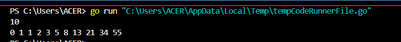
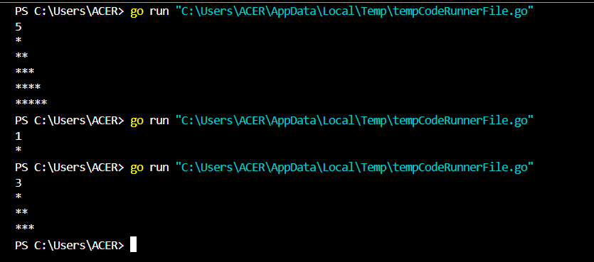
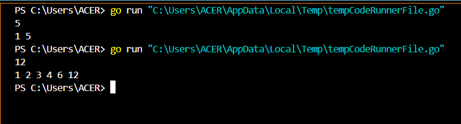
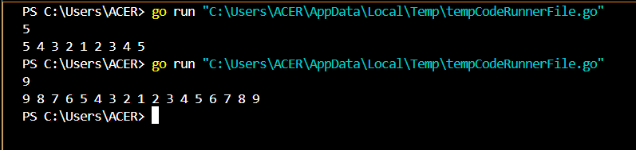
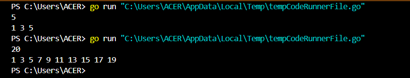
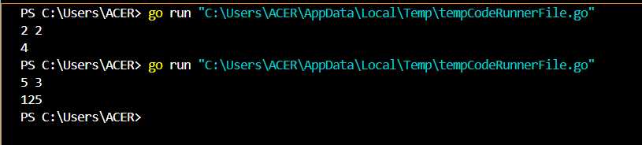

<h1 align="center">Laporan Praktikum Modul 5 <br>Rekursif</h1>
<p align="center">TRISNA KUSUMA RAMADHANY - 103112400277</p>

## Dasar Teori
Rekursi adalah teknik dalam pemrograman di mana sebuah fungsi memanggil dirinya sendiri untuk menyelesaikan suatu permasalahan. Rekursi biasanya digunakan untuk memecahkan masalah yang dapat dibagi menjadi sub-masalah yang lebih kecil dengan pola yang serupa. Dalam rekursif, terdapat dua bagian utama, yaitu base case dan recursive case. Base case akan menghentikan rekursif, sedangan recursive case adalah fungsi yang memanggil dirinya sendiri dengan parameter yang mendekati base case.

## Unguided

### Soal 1
> Deret fibonacci adalah sebuah deret dengan nilai suku ke-0 dan ke-1 adalah 0 dan 1, dan nilai suku ke-n selanjutnya adalah hasil penjumlahan dua suku sebelumnya. Secara umum dapat diformulasikan 𝑆𝑛 = 𝑆𝑛−1 + 𝑆𝑛−2 . Berikut ini adalah contoh nilai deret fibonacci hingga suku ke-10. Buatlah program yang mengimplementasikan fungsi rekursif pada deret fibonacci tersebut.

```go
package main

import "fmt"

// Fungsi untuk menghitung bilangan Fibonacci secara rekursif
func fibonacci(n int) int {
	if n < 2 {
		return n
	}
	return fibonacci(n-1) + fibonacci(n-2)
}

// Fungsi rekursif untuk mencetak deret Fibonacci tanpa menggunakan return
func cetakFibonacci(i, n int) {
	fmt.Print(fibonacci(i), " ")
	if i < n {
		cetakFibonacci(i+1, n)
	}
}

func main() {
	var n int
	fmt.Scan(&n)
	cetakFibonacci(0, n)
}
```


Kode diatas digunakan untuk mengimplementasikan fungsi dari rekursif itu sendiri. Yang dimana ketika program dijalankan, maka akan ada input yang harus di isikan. Jadi inputan yang dimasukan adalah untuk menentukan batas jumlah bilangan fibonacci yang akan dicetak. Sistem dari fibonacci adalah:
```go
Semisal inputan 6, maka:

0 + 0 = 0
0 + 1 = 1
1 + 1 = 2
2 + 1 = 3
3 + 2 = 5
5 + 3 = 8

Outputnya adalah 0 1 1 2 3 5 8
```

#### Fungsi & Prosedur
##### 1. Fungsi fibonacci
```go
// Fungsi untuk menghitung bilangan Fibonacci secara rekursif
func fibonacci(n int) int {
	if n < 2 {
		return n
	}
	return fibonacci(n-1) + fibonacci(n-2)
}
```
Fungsi fibonacci(n) bekerja secara rekursif untuk menghitung bilangan Fibonacci ke-n. Jika n kurang dari 2, fungsi langsung mengembalikan n sebagai base case untuk menghentikan rekursi. Jika n lebih besar atau sama dengan 2, fungsi akan memanggil dirinya sendiri dengan fibonacci(n-1) + fibonacci(n-2), menjumlahkan hasilnya hingga mencapai base case.
#### 2. Prosedur cetakFibonacci
```go
// Fungsi rekursif untuk mencetak deret Fibonacci tanpa menggunakan return
func cetakFibonacci(i, n int) {
	fmt.Print(fibonacci(i), " ")
	if i < n {
		cetakFibonacci(i+1, n)
	}
}
```
Fungsi ini adalah fungsi yang digunakan untuk mencetak nilai dari bilangan fibonacci secara rekursif. Yang dimana terdapat pemanggilan yang memanggil dirinya sendiri yaitu pada bagian cetakFibonacci(i+1, n)

### Soal 2
> Buatlah sebuah program yang digunakan untuk menampilkan pola bintang berikut ini dengan menggunakan fungsi rekursif. N adalah masukan dari user.

<table border="1">
  <tr>
    <th>No</th>
    <th>Masukan</th>
    <th>Keluaran</th>
  </tr>
  <tr>
    <td>1</td>
    <td>5</td>
    <td>*<br>**<br>***<br>****<br>*****</td>
  </tr>
  <tr>
    <td>2</td>
    <td>1</td>
    <td>*</td>
  </tr>
  <tr>
    <td>3</td>
    <td>3</td>
    <td>*<br>**<br>***</td>
  </tr>
</table>

```go
package main

import "fmt"

// Digunakan untuk mencetak bintang sebanyak nilai n
func bintang(n int) {
	if n != 0 {
		fmt.Print("*")
		bintang(n - 1)
	}
}

// Mengatur baris dari output yang akan tampil
func pola(n, baris int) {
	if baris <= n {
		bintang(baris)
		fmt.Println()
		pola(n, baris+1)
	}
}

func main() {
	var n int
	fmt.Scan(&n)
	pola(n, 1)
}
```


Ketika program berjalan, pengguna akan diminta untuk memasukkan sebuah bilangan n, yang menentukan jumlah baris dalam pola segitiga bintang. Program kemudian memanggil fungsi pola(n, 1), yang bekerja secara rekursif untuk mencetak setiap baris pola bintang. Pada setiap pemanggilan pola, fungsi bintang(baris) dipanggil untuk mencetak sejumlah bintang sesuai dengan nilai baris, lalu program berpindah ke baris berikutnya dengan memanggil pola(n, baris+1). Proses ini berlanjut hingga baris melebihi n, yang menjadi kondisi berhenti.

#### a. Prosedur bintang
```go
func bintang(n int) {
	if n != 0 {
		fmt.Print("*")
		bintang(n - 1)
	}
}
```
Fungsi ini digunakan untuk mencetak bintang sebanyak nilai n di dalam satu baris. Hal ini menggunakan rekursif untuk menyelesaikan perulangannya.

#### b. Prosedur pola
```go
func pola(n, baris int) {
	if baris <= n {
		bintang(baris)
		fmt.Println()
		pola(n, baris+1)
	}
}
```
Prosedur `pola(n, baris)` adalah prosedur rekursif yang mencetak pola segitiga bintang secara bertahap, dengan jumlah bintang yang bertambah di setiap baris.

### Soal 3
> Buatlah program yang mengimplementasikan rekursif untuk menampilkan faktor bilangan dari suatu N, atau bilangan yang apa saja yang habis membagi N. Masukan terdiri dari sebuah bilangan bulat positif N. Keluaran terdiri dari barisan bilangan yang menjadi faktor dari N (terurut dari 1 hingga N ya).

<table border="1">
  <tr>
    <th>No</th>
    <th>Masukan</th>
    <th>Keluaran</th>
  </tr>
  <tr>
    <td>1</td>
    <td>5</td>
    <td>1 5</td>
  </tr>
  <tr>
    <td>2</td>
    <td>12</td>
    <td>1 2 3 4 6 12</td>
  </tr>
</table>

```go
package main

import "fmt"

func faktorBilangan(n, i int) {
	if i <= n {
		if n%i == 0 {
		fmt.Print(i, " ")
		}
		faktorBilangan(n, i+1)
	}
}

func main() {
	var n int
	fmt.Scan(&n)
	faktorBilangan(n, 1)
}
```


Ketika program berjalan, program ini akan meminta untuk memasukan nilai dari n. Prosesnya dimulai dengan memanggil fungsi faktorBilangan(n, 1), yang akan memeriksa apakah angka i (dimulai dari 1) adalah faktor dari n dengan melihat apakah n % i == 0. Jika iya, angka tersebut akan dicetak. Setelah itu, fungsi memanggil dirinya sendiri dengan i+1, sehingga pemeriksaan terus berlanjut hingga i lebih besar dari n, yang menjadi kondisi penghentian rekursi.

#### Prosedur faktor bilangan
```go
func faktorBilangan(n, i int) {
	if i <= n {
		if n%i == 0 {
		fmt.Print(i, " ")
		}
		faktorBilangan(n, i+1)
	}
}
```
Prosedur `faktorBilangan(n, i)` adalah prosedur rekursif yang bertugas mencari dan mencetak semua faktor dari bilangan `n`.

### Soal 4
> Buatlah program yang mengimplementasikan rekursif untuk menampilkan barisan bilangan tertentu. Masukan terdiri dari sebuah bilangan bulat positif N. Keluaran terdiri dari barisan bilangan dari N hingga 1 dan kembali ke N.

<table border="1">
  <tr>
    <th>No</th>
    <th>Masukan</th>
    <th>Keluaran</th>
  </tr>
  <tr>
    <td>1</td>
    <td>5</td>
    <td>5 4 3 2 1 2 3 4 5</td>
  </tr>
  <tr>
    <td>2</td>
    <td>9</td>
    <td>9 8 7 6 5 4 3 2 1 2 3 4 5 6 7 8 9</td>
  </tr>
</table>

```go
package main

import "fmt"

// Fungsi barisan digunakan untuk mencetak angka dari n-1 kemudian ke n lagi
func barisan(n, angka int) {
	fmt.Print(angka, " ")
	if angka > 1 {
		barisan(n, angka-1)
		fmt.Print(angka, " ")
	}
}

func main() {

	var n int
	fmt.Scan(&n)
	barisan(n, n)

}
```

Ketika program dijalankan, pengguna akan diminta memasukkan sebuah angka N. Program kemudian memanggil fungsi rekursif barisan(n, n), yang mencetak angka dari N hingga 1 secara menurun. Jika angka lebih besar dari 1, fungsi akan terus dipanggil dengan nilai yang berkurang hingga mencapai 1. Setelah mencapai 1, rekursi kembali ke atas dan mencetak angka dalam urutan naik hingga kembali ke N, menghasilkan pola simetris seperti contoh "5 4 3 2 1 2 3 4 5".

#### Prosedur barisan
```go
func barisan(n, angka int) {
	fmt.Print(angka, " ")
	if angka > 1 {
		barisan(n, angka-1)
		fmt.Print(angka, " ")
	}
}
```
Prosedur ini yang digunakan untuk mencetak angka, dari n hingga 1, kemudian kembali lagi ke nilai awal n. Ketika program berjalan, nilai n akan masuk ke prosedur barisan dan kedalam dua variabel yang berbeda, yaitu variabel n dan angka yang berfungsi untuk menerima inputan. Kemudian sistem akan mencetak nilai awal dari n, dan setelah itu nilai n yang tersimpan dalam variabel angka akan dicek, apakah lebih dari 1, jika iya maka nilai n dalam variabel angka akan dikurangi dengan 1. Sehingga angka terus berkurang hingga mencapai 1. Setelah mencapai 1, rekursi kembali ke atas dan mencetak angka dalam urutan naik hingga kembali ke n.

### Soal 5
> Buatlah program yang mengimplementasikan rekursif untuk menampilkan barisan bilangan ganjil. Masukan terdiri dari sebuah bilangan bulat positif N. Keluaran terdiri dari barisan bilangan ganjil dari 1 hingga N. Contoh masukan dan keluaran:

<table border="1">
  <tr>
    <th>No</th>
    <th>Masukan</th>
    <th>Keluaran</th>
  </tr>
  <tr>
    <td>1</td>
    <td>5</td>
    <td>1 3 5</td>
  </tr>
  <tr>
    <td>2</td>
    <td>20</td>
    <td>1 3 5 7 9 11 13 15 17 19</td>
  </tr>
	</table>

```go
package main

import "fmt"

// Prosedur untuk mencetak angka ganjil dari 1 hingga n
func cetakGanjil(i, n int) {
	if i <= n {
		fmt.Print(i, " ")
		cetakGanjil(i+2, n)
	}
}

func main() {
	var n int
	fmt.Scan(&n)
	cetakGanjil(1, n)
}
```


Ketika program berjalan, program akan meminta inputan berupa nilai n, yang kemudian nilai n akan di eksekusi oleh prosedur cetakGanjil, yang dimana kita menentukan nilai awal adalah 1. nilai 1 akan masuk ke dalam variabel i, yang kemudian akan dicek apakah nilai dari i <= n. Jika true, maka program akan mencetak i dan i ditambah dengan 2. Ketika nilai i sudah sama atau lebih besar dari nilai n, maka program akan berhenti.

```go
// Prosedur untuk mencetak angka ganjil dari 1 hingga n
func cetakGanjil(i, n int) {
	if i <= n {
		fmt.Print(i, " ")
		cetakGanjil(i+2, n)
	}
}
```
Prosedur ini digunakan untuk mencetak bilangan ganjil dari 1 hingga ke n


### Soal 6
> Buatlah program yang mengimplementasikan rekursif untuk mencari hasil pangkat dari dua buah bilangan. Masukan terdiri dari bilangan bulat x dan y. Keluaran terdiri dari hasil x dipangkatkan y. Catatan: diperbolehkan menggunakan asterik "", tapi dilarang menggunakan import "math". Contoh masukan dan keluaran:

<table border="1">
  <tr>
    <th>No</th>
    <th>Masukan</th>
    <th>Keluaran</th>
  </tr>
  <tr>
    <td>1</td>
    <td>2 2</td>
    <td>4</td>
  </tr>
  <tr>
    <td>2</td>
    <td>5 3</td>
    <td>125</td>
  </tr>
	</table>

```go
package main

import "fmt"

func pangkat(x, y int) int {
	if y == 0 {
		return 1
	}

	return x * pangkat(x, y-1)
}

func main() {
	var x, y int
	fmt.Scan(&x, &y)
	fmt.Println(pangkat(x, y))
}
```


Ketika program dijalankan, akan diminta sebuah 2 inputan, yaitu x dan y. x untuk angka utama, sedangkan y sebagai pangkat. Jadi program akan memeriksa, apakah nilai y == 0 atau tidak. Jika iya, maka otomatis outputnya adalah 1. Jika bukan 0, maka nilai dari x dikali dengan x, y-1.
